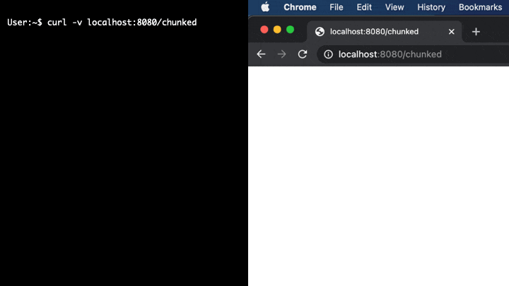

Response
====

In the [first tutorial](/01_handler/README.md) we saw that a handler writes responses via an interface type with three methods.

```go
type ResponseWriter interface {
	Header() Header
	Write([]byte) (int, error)
	WriteHeader(statusCode int)
}
```

But the function signature of a handler has no return type, and there is no requirement to call any of the above methods. We can create an empty handler and Go will return a valid response.

```console
user:~$ curl -v localhost:8080/empty
> GET /empty HTTP/1.1
> Host: localhost:8080
> User-Agent: curl/7.64.1
> Accept: */*
>
< HTTP/1.1 200 OK
< Date: Mon, 22 Feb 2021 19:21:53 GMT
< Content-Length: 0
<
```

The response lines, including the status code, `Date`, and `Content-Length` headers, are automatically created by the server. Let's examine this process further by adding content. We can use the `Write` method directly by casting a string to a slice of bytes.

```go
func textHandler(w http.ResponseWriter, r *http.Request) {
	w.Write([]byte("Example text"))
}
```

```console
user:~$ curl -v localhost:8080/text
> GET /text HTTP/1.1
> Host: localhost:8080
> User-Agent: curl/7.64.1
> Accept: */*
>
< HTTP/1.1 200 OK
< Date: Wed, 24 Feb 2021 21:05:56 GMT
< Content-Length: 12
< Content-Type: text/plain; charset=utf-8
<
Example text
```

In addition to the headers seen in the previous response, the server now adds a `Content-Type` line. The value of this header is detected automatically from the bytes we write to the response. You can experiment with the various signatures using the function [`DetectContentType`](https://golang.org/pkg/net/http/#DetectContentType). We can also manually set this header via the `Header()` method of the `ResponseWriter` in order to skip auto-detection of content.

```go
func textHandler(w http.ResponseWriter, r *http.Request) {
	w.Header().Set("Content-Type", "text/plain; charset=utf-8")
	w.Write([]byte("Example text"))
}
```

Likewise, if we do not specify a status code for the response using the `WriteHeader` method, the server will return an implicit `200` status code. `WriteHeader` must be called before any content is written, or the given status code will be ignored and logged as superfluous. Note that invalid headers, currently defined by Go to be anything less than 100 or greater than 999, will cause the current connection to panic.

And that's it for the `ResponseWriter`. Although the type may seem simplistic, we only need these three methods to construct a variety of complex web applications.


## Stupid HTTP Tricks

Ultimately, it is up to the client how to interpret the bytes in our response. A modern web browser, such as Chrome or Firefox, can render HTML, apply CSS, and execute JavaScript.

In this tutorial's [example server](response.go), we'll see some of the behaviors that can be triggered with headers.

For instance, changing the `Content-Type` header can dramatically alter how a client handles the response body. In the three example handlers `htmlHandler`, `htmlAsTextHandler`, `htmlAsAttachmentHandler`, the response body is exactly the same, only the headers are different. When viewed in a browser, these headers will cause the response to be rendered as HTML, viewed as raw source, and downloaded as an HTML file, respectively.

There are also behaviors that are not clearly defined by standards, with varying implementations between browsers. One such behavior is the rendering of chunked responses. The Go web server will send chunked responses by default whenever the written response exceeds the write buffer, which is about 4 KB. We can also manually trigger this behavior by flushing the response via the [`Flusher`](https://golang.org/pkg/net/http/#Flusher) interface. However, since the `ResponseWriter` interface doesn't require a `Flush` method, we need to first assert that our response type implements the `Flusher` interface.

```go
func chunkedHandler(w http.ResponseWriter, r *http.Request) {
	w.Header().Set("Content-Type", "text/plain; charset=utf-8")
	w.Header().Set("Transfer-Encoding", "chunked")
	for i := 0; i < 10; i++ {
		fmt.Fprintf(w, "%d\n", i)
		if f, ok := w.(http.Flusher); ok {
			f.Flush()
		}
		time.Sleep(100 * time.Millisecond)
	}
}
```

Note that we aren't required to specify either the `Content-Type` or the `Transfer-Encoding` headers as the same values will be automatically detected, but we do so above to be explicit.

The response to this chunked handler is rendered differently by `curl` versus a web browser like Chrome.



Chrome's rendering, however, can be altered via a special header, `X-Content-Type-Options` with the value `nosniff`, that will change the browser's behavior to match `curl`.


Other browsers, such as Safari, will ignore this header and render the response as shown in the first image.

There are also a few headers where the content of the response is irrelevant. For instance, adding a `Refresh` header will cause browsers to refresh the current page after the given number of seconds. An optional `url` parameter can be given to change the target of the refresh.

Similarly, redirection to a different URL can be performed by adding a `Location` header. Go's standard library includes a [`Redirect`](https://golang.org/pkg/net/http/#Redirect) function to simplify this process. The function will also write a small HTML body with a link to the new URL in the event that redirection fails.

While rarely used, there's even support for authentication in HTML requests. The example web server includes a handlers that uses the `WWW-Authenticate` header to prompt users for a username and password, returning an unauthorized status when given invalid credentials.

There's an extensive list of [HTTP headers on Wikipedia](https://en.wikipedia.org/wiki/List_of_HTTP_header_fields), some of which are non-standard or rarely encountered. [Mozilla](https://developer.mozilla.org/en-US/docs/Web/HTTP/Headers) also has a fantastic resource for more of the common headers.
